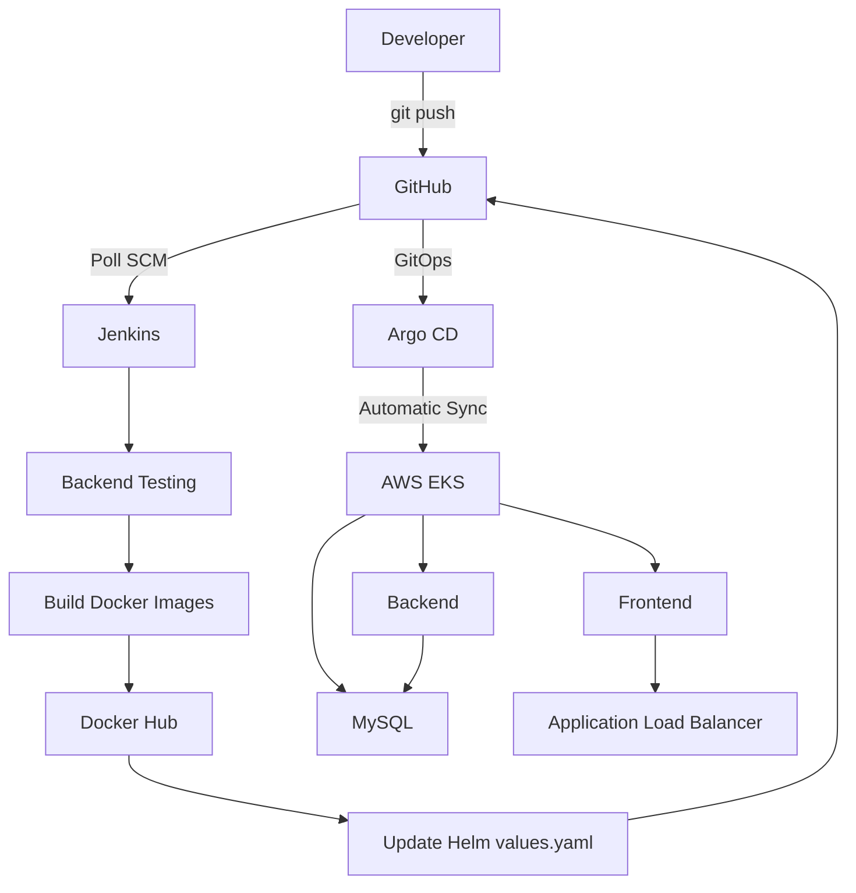

# 🛒 E-Commerce CI/CD & GitOps Platform

> **End-to-end DevOps pipeline for a containerized 3-tier e-commerce application — from code commit to production deployment on AWS EKS.**


---

## 📌 Overview

This project demonstrates a **production-grade CI/CD and GitOps workflow** for a containerized 3-tier e-commerce application. It covers the full DevOps lifecycle — from source control and automated testing to container builds, Helm-based Kubernetes deployments, and GitOps-driven continuous delivery on AWS EKS.

**Application Stack:**
- **Frontend** — HTML, CSS, JavaScript
- **Backend** — Python (Flask)
- **Database** — MySQL

The entire delivery pipeline is automated: Jenkins handles CI (testing, building, pushing images, updating Helm), and Argo CD handles CD (detecting Git changes and syncing the cluster automatically).

---

## 🏗️ CI/CD Architecture



---

## 🧩 3-Tier Application Architecture

```
               ┌──────────────────────────┐
               │     AWS Load Balancer     │
               └────────────┬─────────────┘
                            │
               ┌────────────▼─────────────┐
               │   Kubernetes Ingress      │
               └────────────┬─────────────┘
                            │
               ┌────────────▼─────────────┐
               │  Frontend  (HTML/CSS/JS)  │
               └────────────┬─────────────┘
                            │
               ┌────────────▼─────────────┐
               │  Backend   (Python/Flask) │
               └────────────┬─────────────┘
                            │
               ┌────────────▼─────────────┐
               │  Database  (MySQL)        │
               │  Persisted via AWS EBS    │
               └──────────────────────────┘
```

---

## ✨ Key Features

| # | Feature |
|---|---------|
| 🔁 | **Automated CI/CD** — Full pipeline from code push to production deployment |
| 🏷️ | **Git SHA image tagging** — Every Docker image is tagged with the exact commit SHA for full traceability |
| 🔍 | **Change detection** — Jenkins only triggers application CI when `frontend/` or `backend/` files change, preventing Helm-only commits from causing redundant rebuilds |
| 📦 | **Helm packaging** — All Kubernetes manifests managed as a versioned, parameterised Helm chart |
| 🔄 | **GitOps with Argo CD** — GitHub is the single source of truth; Argo CD automatically reconciles the cluster |
| 💾 | **Persistent MySQL storage** — AWS EBS GP3 PersistentVolumeClaims ensure data survives pod restarts |
| 🌐 | **AWS Application Load Balancer** — External traffic routed through Kubernetes Ingress |
| 🔐 | **Secrets-free source code** — All credentials stored in Jenkins Credentials, never in Git |
| 🐳 | **Local dev with Docker Compose** — Full stack runs locally without any cloud dependencies |
| 💰 | **Cost-aware infrastructure** — EKS resources torn down after use; config in Git for fast recreation |

---

## 🛠️ Technology Stack

| Category | Technology |
|----------|------------|
| **Frontend** | HTML, CSS, JavaScript |
| **Backend** | Python, Flask |
| **Database** | MySQL |
| **Containerisation** | Docker, Docker Compose |
| **Orchestration** | Kubernetes |
| **Cloud Platform** | AWS (EKS, EBS, ALB) |
| **CI** | Jenkins |
| **CD / GitOps** | Argo CD |
| **Package Management** | Helm |
| **Container Registry** | Docker Hub |
| **Source Control** | Git, GitHub |
| **Storage** | AWS EBS GP3 |
| **Ingress** | Kubernetes Ingress + AWS ALB |
| **OS** | Ubuntu Linux |

---

## 📁 Repository Structure

```
e-cm-devops/
│
├── argocd/
│   └── ecommerce-application.yaml    # Argo CD Application manifest
│
├── backend/
│   ├── app.py                        # Flask application
│   ├── Dockerfile
│   ├── requirements.txt
│   └── .dockerignore
│
├── database/
│   └── init.sql                      # MySQL initialisation script
│
├── frontend/
│   ├── index.html
│   ├── script.js
│   ├── style.css
│   ├── Dockerfile
│   └── .dockerignore
│
├── helm/
│   └── ecommerce/
│       ├── Chart.yaml
│       ├── values.yaml               # Image tags updated by Jenkins
│       └── templates/
│
├── jenkins/
│   └── Jenkinsfile                   # Declarative pipeline definition
│
├── docker-compose.yml                # Local development
├── eks-cluster.yaml                  # EKS cluster config
├── m7i-nodegroup.yaml                # Node group config
├── gp3-storageclass.yaml             # GP3 StorageClass
└── iam_policy.json                   # Required IAM permissions
```

---

## 🔄 Jenkins CI Pipeline

The pipeline is defined in `jenkins/Jenkinsfile` and consists of the following stages:

```
Checkout
    │
    ▼
Detect Application Changes          ← Skips CI if only Helm changed
    │
    ▼
Backend Testing                     ← Python venv + pytest
    │
    ▼
Build Docker Images                 ← Tagged with Git commit SHA
    │
    ▼
Push to Docker Hub
    │
    ▼
Sync with GitHub                    ← git fetch + rebase before editing
    │
    ▼
Update Helm values.yaml             ← New image tag written
    │
    ▼
Helm Lint / Validate
    │
    ▼
Push Helm Changes to GitHub         ← Triggers Argo CD
```

**Docker images produced:**

```
puneetb15/ecommerce-frontend:<commit-sha>
puneetb15/ecommerce-backend:<commit-sha>
```

Using the commit SHA (instead of `latest`) gives full version traceability and makes rollback straightforward.

---

## 🚢 GitOps with Argo CD

Argo CD watches the `helm/ecommerce/values.yaml` in GitHub. When Jenkins commits a new image tag, Argo CD detects the drift and automatically synchronises the cluster.

```
Jenkins pushes new tag to values.yaml
            │
            ▼
       GitHub (source of truth)
            │
            ▼
    Argo CD detects drift
            │
            ▼
   Argo CD reconciles cluster
            │
            ▼
   New image deployed on EKS
```

A healthy deployment in the Argo CD UI shows:

```
Sync:   ✅ Synced
Health: 💚 Healthy
```

---

## 💾 Persistent MySQL Storage

MySQL data is decoupled from the pod lifecycle using Kubernetes Persistent Volumes backed by AWS EBS GP3:

```
MySQL Pod  →  PersistentVolumeClaim  →  GP3 StorageClass  →  AWS EBS
```

Configuration: `gp3-storageclass.yaml`

---

## 🐳 Local Development

Run the full stack locally without any cloud infrastructure:

```bash
# Start all services
docker compose up --build

# Stop all services
docker compose down
```

---

## ☁️ AWS Infrastructure Setup

> **Prerequisites:** AWS CLI, kubectl, eksctl, Helm, Docker, Git, Jenkins, Argo CD

```bash
# 1. Configure AWS credentials
aws configure

# 2. Verify identity
aws sts get-caller-identity

# 3. Create EKS cluster
eksctl create cluster -f eks-cluster.yaml

# 4. Add node group
eksctl create nodegroup -f m7i-nodegroup.yaml

# 5. Apply GP3 storage class
kubectl apply -f gp3-storageclass.yaml

# 6. Install Argo CD
kubectl create namespace argocd
kubectl apply -n argocd -f https://raw.githubusercontent.com/argoproj/argo-cd/stable/manifests/install.yaml

# 7. Apply Argo CD application
kubectl apply -f argocd/ecommerce-application.yaml
```

---

## 🧰 Useful Commands

```bash
# Cluster health
kubectl get nodes
kubectl get pods
kubectl get svc
kubectl get ingress

# Argo CD
kubectl get application -n argocd

# Helm
helm lint helm/ecommerce
helm template ecommerce ./helm/ecommerce

# AWS
aws eks list-clusters --region ap-south-1
```

---

## 🧪 Testing the Pipeline

Make a change to any application file and push:

```bash
# Edit frontend or backend
vim frontend/index.html

git add .
git commit -m "chore: test pipeline trigger"
git push origin main
```

Jenkins picks up the change via Poll SCM (every minute), runs the full pipeline, and Argo CD deploys the new image to EKS automatically.

---

## 🐛 Challenges Solved

| Challenge | Root Cause | Solution Applied |
|-----------|-----------|-----------------|
| `externally-managed-environment` error | PEP 668 Python protection on Ubuntu | Created a `venv` inside the Jenkins workspace |
| Docker daemon permission denied | Jenkins user not in Docker group | `sudo usermod -aG docker jenkins` |
| `git push` rejected | Remote had Helm commits not in local workspace | Added `git fetch origin main && git rebase origin/main` before editing `values.yaml` |
| Rebase failed on dirty tree | Helm values modified before sync | Reordered pipeline — sync Git first, then update Helm |
| Jenkins self-triggering loop | Jenkins Helm commits triggering another CI run | Added a change-detection stage; pipeline exits early if only Helm files changed |

---

## 📈 Future Improvements

- [ ] **Terraform** — Infrastructure-as-Code for EKS provisioning
- [ ] **GitHub Webhooks** — Replace Poll SCM for instant trigger on push
- [ ] **SonarQube** — Static code quality analysis stage
- [ ] **Trivy** — Container image vulnerability scanning
- [ ] **Prometheus + Grafana** — Metrics and dashboards
- [ ] **Centralised Logging** — EFK / CloudWatch log aggregation
- [ ] **HTTPS** — AWS Certificate Manager + Route 53 custom domain
- [ ] **HPA** — Horizontal Pod Autoscaling based on CPU/memory
- [ ] **Automated Rollback** — Argo CD rollback on failed health check

---

## 🎯 DevOps Concepts Demonstrated

`Linux` · `Git & GitHub` · `Docker` · `Docker Compose` · `Kubernetes` · `Amazon EKS` · `Helm` · `Jenkins` · `CI/CD` · `Docker Hub` · `Argo CD` · `GitOps` · `Kubernetes Ingress` · `AWS ALB` · `AWS EBS` · `Persistent Storage` · `Cloud Infrastructure` · `Troubleshooting` · `Cloud Cost Management`

---

## 👨‍💻 Author

**Puneet Bhairannavar** — DevOps & Cloud Enthusiast

📍 Bengaluru, Karnataka

[](https://github.com/punya-DevOps)
[](https://www.linkedin.com/in/puneet-bhairannavar)

---

> *"Code → CI → Container → Registry → GitOps → Kubernetes → Application"* 🚀
